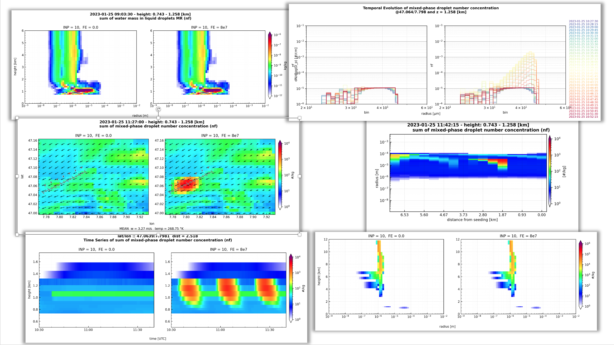

# Running the COSMO-SPECS Eriswill Testcase01 on Levante

## Science Background


* Eriswill Testcase01 is a realcase scenario that runs COSMO-SPECS simulations centered around a location in the swiss alps

* IC and BC data have been prepared based on a sequence of nested COSMO runs

* Eriswill is a place where a measurement campaign was conducted by ETH Zurich and TROPOS 
    
    * wintertime fog or low-level stratus which consists mainly of super-cooled liquid droplets was perturbed by ice nucleating particles

    * primary ice formation was investigated with a sophisticated set of measurement devices   

    


## Prepare and Run Test Case

### Installation
For getting and installing the COSMO-SPECS source code, please follow the instruction here: 
- [COSMO SPECS Installation at DKRZ](../../docs/Installation-at-DKRZ.md)

### Test Case Location

```
cd testcases/RUN_ERISWILL_TESTCASE01/
```

### Get the Additional Data

* *download tar from zenodo* - This is a future option. Upload to zenodo needs to be done.

* shortcut copy it from local dir on levante

```
cp /work/bb1262/data/cosmo-specs/cosmo-specs-eriswill-testcase_ic-bc-cosin-data.tar.gz .
tar xzvf cosmo-specs-eriswill-testcase_ic-bc-cosin-data.tar.gz
```

### Test Run

* get your compiled executable
    ```
    cp ../../build/psbm_fd4_levante .
    ```
* set your account details in the run script, i.e.

    ```
    > grep -in account run_COSMO-SPECS_levante 
    5:#SBATCH --account=bb1262    #### CHANGE THIS TO YOUR ACCOUNT
    ```
* choose a domain size of COSMO:
  * 122x112
  * 42x32
  * 12x12 
  * set it in`run_COSMO-SPECS_levante`: E.g. `CASE='42x32'`
* submit job
    ```
    sbatch run_COSMO-SPECS_levante
    ```

### Output Check List

* Take a look at `*.log` & `*.err` files!

* Is output written into `COS_out/20230125_*x*` and in `Ew1_2023020809_*x*.nc`? 

* Meteogramm data output in `M_Eriswil_SPECS.nc`?

</br></br></br>

# Documentation: COSMO-SPECS Ensemble Run Script `run_ensemble_CS_levane`
## Overview
This script automates the process of modifying input files for the COSMO-SPECS model, submitting jobs to a batch system, waiting for the jobs to be assigned to a node, and tracking metadata about each run. The script also has functionality to wait for job completion and copy specific output files to a designated directory.

## Dependencies:
- Relies on namelist_converter.py for converting FORTRAN namelists to JSON format.Install the dependency `f90nml` via `pip`.
```console
pip install f90nml
```

## Main Execution:
1. Determines the current date and time.
2. Sets the names and paths for necessary scripts and constants.
3. Initializes the metadata JSON file for the ensemble run. The JSON file contains the information of all INPUT files for this run.
4. Iterates through combinations of flare_emission_values and background_inp_values to submit ensemble runs.
5. Cleans up the metadata JSON file.
6. Optionally, waits and tries to copy output files to a designated directory. (Not done jet!!)

## Integral Function: `replace_params_and_run()`
### Purpose:
The [replace_params_and_run](https://github.com/KarlJohnsonnn/comso-specs-eriswil/blob/dd72615fd1993cbc9fb7249738deb4417fb6e2f4/run_ensemble_CS_levante#L5) function is central to this script. Its main objective is to modify specific parameters in input files for a simulation run, commence the simulation job, hold until a computational node is allocated for the job, and subsequently output pertinent details about the job. This effectively automates the workflow for executing simulation runs with different parameters.

### Parameters:
**1. Flare Status (`$1`):**
- *Description:* Represents the status of the flare.
- *Values:*
    - **"no"**: Indicates the flare is not active.
    - **float > 0.0**: Flare is active and the value is indicative of the flare emission.

**2. Initial Value (`$2`):**

- *Description:* Specifies the initial value (float > 0.0) for dnap_init.

**3. Output JSON Name (`$3`):**

- *Description:* Defines the name for the output JSON file, destined to hold metadata related to the run.

### Procedure: 

**1. Check Flare Status:** 
The function assesses the first parameter to discern the flare's status. If its value is 'no', the flare is deemed inactive.

**2. Timestamps:**
Gains the current time in seconds (since 1970-01-01 00:00:00 UTC).
Formulates this timestamp into the "YYYYMMDD_HHMMSS" structure.

**3. Output Filenames:**
Based on the current time, it forms unique identifiers for the output files.

**4. Modification with sed:**
- Modifies the flare_emission value in the input file.
- Alters the dnap_init value.
- Updates the lflare status.
- Changes the outputname in the input file to the recently created name. This is performed on the `INPUT_ORG_$DOMAIN` file.
- It also adjusts dates in the `INPUT_DIA` file with the commencement time of the run.

**5. Job Submission:**
Deploys the sbatch command to commence a job.
The returned job ID is stored.

**6. Node Allocation:**
Utilizes the [wait_for_node](https://github.com/KarlJohnsonnn/comso-specs-eriswil/blob/dd72615fd1993cbc9fb7249738deb4417fb6e2f4/run_ensemble_CS_levante#L45) function to delay until a computational node is designated to the job.
Display Information: Outputs a message, revealing the job ID, start time, allocated node, and other parameters used.

**7. JSON Metadata:** 
The [add_metadata_to_json](https://github.com/KarlJohnsonnn/comso-specs-eriswil/blob/dd72615fd1993cbc9fb7249738deb4417fb6e2f4/run_ensemble_CS_levante#L57) function appends simulation details from FORTRAN namelists to an existing JSON file. Each entry includes details like start time, job ID, computational node, domain, and settings extracted from specified namelist files. The function ensures proper JSON formatting by removing trailing commas and finalizing the structure with appropriate closing brackets.


**8. Wait Sequence:** 
Holds for 20 seconds, presumably to let the simulation environment read files or complete certain operations.

**9. Usage:**
To launch a simulation with a deactivated flare, an initial dnap_init value of 10, and desiring to save the metadata in outputname.json, the call would be:

```bash
replace_params_and_run "no" "10" "outputname.json"
```

### Overview:
This function is integral to the script, acting as a catalyst to automate several pivotal steps needed for configuration, initiation, and monitoring of simulation runs. Through this function, the script eases the process of executing multiple simulations with diverse parameters.


## INPUT_DIA Syntax Rule:
To run the ensemble script properly, the User has to ensure the syntax rule in the INPUT_DIA file (i.e. the meteogram definition):
**INPUT_DIA**: The `station_list` variable is defindes as:
```fortran
&DIACTL
...
!                 i, j,   lat   ,   lon  ,     station_name
stationlist_tot = 0, 0, 47.0799 , 7.8507 , '00-20230905_114224',
                  0, 7, 47.0447 , 7.7707 , '07-20230905_114224' ,
                  2, 8, 47.0511 , 7.7798 , '28-20230905_114224' ,
                  4, 9, 47.0575 , 7.7890 , '49-20230905_114224' ,
\END
```
**Note:** ystation_name is limited to 18 characters, limiting the choise of the name given the date as unique identifyer for ensemble runs. We use the format `IJ-YYYYMMMDD_HHMMSS`, were `IJ` is the meteogram number and `YYYYMMMDD_HHMMSS` is the date format that identifies the meteograms to an ensemble run. The date is adapeted automatically for each new run of `run_ensemble_CS_levane`.
    
## Usage
We provide an [example script](https://github.com/KarlJohnsonnn/comso-specs-eriswil/blob/dd72615fd1993cbc9fb7249738deb4417fb6e2f4/run_ensemble_CS_levante#L5) to generate an ensemble of simulations with different inital parameter configurations. To run the script, navigate to the directory containing it and execute:
```bash
./run_ensemble_CS_levante
```

### Main Execution Workflow of the Script:
#### Initialization:
1. Captures the current timestamp (startdtime).
    - Sets constants like the running script name (RUN_SCRIPT) and the current directory (RUN_SCRIPT_DIR).
    - Defines the domain (DOMAIN) and parameter combinations for flare emissions and background inputs.
    - Initializes a metadata JSON file (outputnameJson) for logging.
2. Simulation Execution:
    - Prints out the ensemble run date for user reference.
    - Iterates over flare emission and background input combinations. For each combination, the script modifies the simulation parameters and launches the respective job using replace_params_and_run.
3. Cleanup: 
    - Removes redundant entries in the metadata file to finalize it in proper JSON format.

</br></br></br></br>

# MultiPanelPlot class

## Introduction
The MultiPanelPlot class is a versatile tool designed to visualize multi-panel plots, especially tailored for visualizing specific scientific data sets generated by [COSMO-SPECS](https://gitea.tropos.de/COSMO-SPECS-Team/COSMO-SPECS). The class is part of the vizz module and offers various methods and functionalities to customize and enhance the visual representation of data.

## Dependencies
- numpy
- xarray
- matplotlib
- ... [other libraries from vizz.py]

## Reading in the data 
The data can be provied in different ways.

-  directly as list of NetCDF files:
    ```python
    root_path  = f'/work/bb1262/user/schimmel/cosmo-specs-torch/'
    data_path  = root_path + f'/cosmo-specs/testcases/RUN_ERISWILL_TESTCASE01/{test_case}/'
    d3_files = glob.glob( data_path + '3D_*.nc' )
    print('read all 3D nc files:')
    
    data = vizz.read_file_list(sorted(d3_files), varnames=['nf', 'vt', 'ut', 'wt', 't', 'rho', 'qw'])
    ```


- indicrect using the meta data of an ensemble simulation run:
    ```python
    import vizz

    root_path = '/work/bb1262/user/schimmel/cosmo-specs-torch/'
    test_case = 'cs-eriswil__20230821_172639'
    data_path = root_path + f'/cosmo-specs/testcases/RUN_ERISWILL_TESTCASE01/{test_case}/'

    with open(meta_pdata_path + f'{test_case}.json'ath) as f:
        metadata = json.load(f)

    d3_files = [data_path + '3D_' + file + '.nc' for file in metadata.keys()]

    data = vizz.read_file_list(d3_files, varnames=['nf', 'vt', 'ut', 'wt', 't', 'rho', 'qw'])
    ```

- directly parse a list of files to the vizualisation class, see examples below.

## Initialization
To create a multi-panel plot, initialize an instance of the [MultiPanelPlot](https://github.com/KarlJohnsonnn/comso-specs-eriswil/blob/dd72615fd1993cbc9fb7249738deb4417fb6e2f4/python/vizz.py#L260) class as shown below:

```python
import vizz

plot = vizz.MultiPanelPlot(
    data,
    metadata=metadata,
    varname='nf',
    nrows=1,
    ncols=2,
    mode='area',
    vmin=1.0,
    vmax=1.0e4,
    ...
)
```

Parameters:

- `data`: Data to be visualized. Can be a dict of xarray Datasets or a list of NetCDF file paths.
- `metadata`: Metadata associated with the data, if an ensemble of runs was computed, otherwise `None`
- `varname`: Name of the variable to be plotted.
- `nrows` and ncols: Number of rows and columns for the multi-panel plot.
- `mode`: Visualization mode. E.g., 'area', 'profile'.
- `vmin` and vmax: Minimum and maximum values for the color scale.
- ... [other parameters]

## Features & Methods
### Add Ruler to Plot
You can add a ruler to the plot to measure distances or highlight specific regions:

```python
plot.add_ruler(lat_start, lon_start, lat_end, lon_end)
```

### Display and Save the Plot
To display the plot:

```python
plot.display(timestep=i, title=tit)
```

### To save the plot to a file:

```python
plot.save_figure(f'/path/to/save/{str(i).zfill(3)}_nf.png')
```

## Examples
### Area Mode Visualization
```python
plot1 = vizz.MultiPanelPlot(
    data,
    metadata=metadata,
    varname='nf',
    nrows=1,
    ncols=2,
    mode='area',
    ...
)
plot1.display(timestep=i, title=tit)
```

### Profile Mode Visualization
```python

plot2 = vizz.MultiPanelPlot(
    data,
    metadata=metadata,
    varname='nf',
    nrows=1,
    ncols=2,
    mode='profile',
    ...
)
```